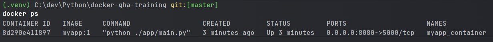

# Docker GHA Training

The goal of this training is to learn how to use Docker and GitHub Actions to build, test and deploy a simple web application. In this training, we will use a simple web application written in Python and Flask.

## License

This project is licensed under the MIT License - see the [LICENSE](LICENSE) file for details.

## Docker Image Creation

1. Fork the repo : done but on GitHub a fork can't be private
2. I use the alpine tag to use the latest alpine image version of python, the alpine version is a small and secure version of python image.
3. I build the image with the command `docker build -t myapp:1 .`
4. I run the container with the command `docker run --name myapp_container -p 8080:5000 myapp:1`
5. I check if the container is running and accessible with the command `docker ps` to list all the running containers.

## Docker Compose Configuration

1. I added the restart: unless-stopped to the myapp service so that it always restarts unless it's manually stopped
2. I chose the latest version as of today with the alpine tag. I then created a `secrets` folder with a `db_password.txt`
file that contains the password. I defined a volume and added a condition to starts the myapp container with the
`depends_on` option and the condition for the postgres service to be healthy (`service_healthy`). This condition requires
that I define a healthcheck on the postgres service, therefor I added `healthcheck` to run a postgres specific command for that.
Finally, I started the stack with the command `docker compose up`.

## CI/CD with GitHub Actions

